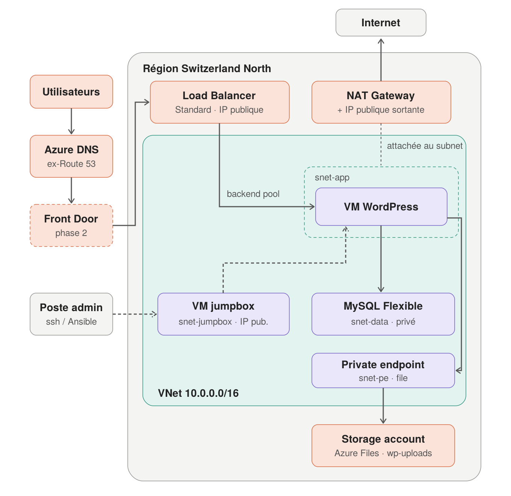
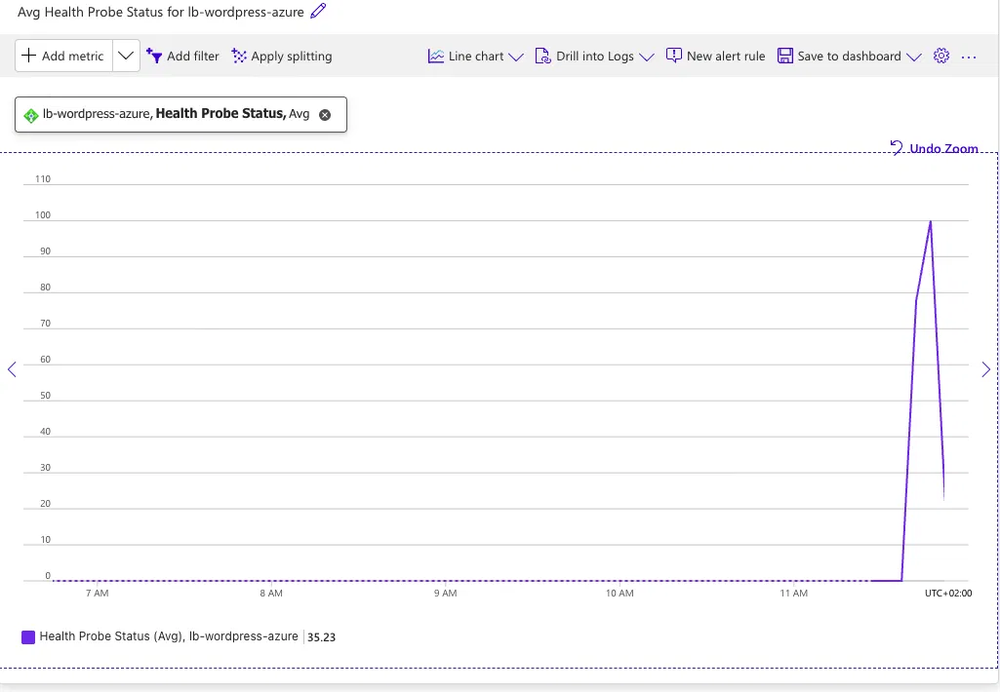
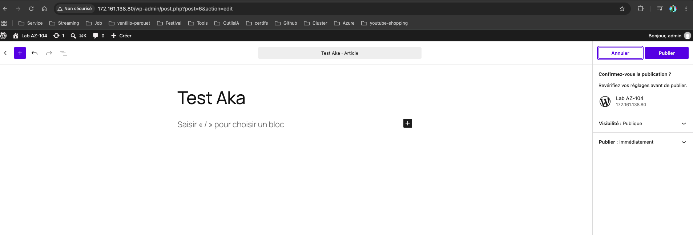

# WordPress sur Azure — Terraform + Ansible

Lab de préparation à l'**AZ-104** : reconstruction sur Azure d'une architecture WordPress
déjà réalisée sur AWS, en Infrastructure as Code.

- **Terraform** : infrastructure (provider `azurerm`)
- **Ansible** : configuration des VM (à partir de l'étape 03)
- **Région** : Switzerland North
- Une étape = un tag git annoté

## Architecture cible



## Roadmap

| Étape | Contenu | Ressources payantes | Coût estimé | Statut |
|---|---|---|---|---|
| 00 | Socle : repo, provider, RG, budget | aucune (RG gratuit) | 0 | ✅ |
| 01 | Réseau : VNet, subnets, NSG, NAT Gateway | NAT Gateway | à estimer | ✅ |
| 02 | VM WordPress + jumpbox | VM, disques, IP publique | à estimer | ✅ |
| 03 | Load Balancer + Ansible | LB Standard, IP publique | à estimer | ✅ |
| 04 | MySQL Flexible + WordPress | MySQL Flexible | à estimer | ✅ |
| 05 | Azure Bastion | Bastion | à estimer | ⏳ |
| 06 | Stockage | Storage account | à estimer | ⏳ |
| 07 | Identité | — | à estimer | ⏳ |
| 08 | Monitoring / backup | Log Analytics, Backup | à estimer | ⏳ |

Coûts à estimer avec la [calculatrice Azure](https://azure.microsoft.com/pricing/calculator/).
Règle : `terraform destroy` en fin de chaque session.

## Démarrage rapide

```
az login → export mdp MySQL → terraform apply → ~/.ssh/config → ansible-playbook → tests → terraform destroy
```

**Prérequis** : Terraform ~> 1.16, Azure CLI, Ansible (`brew install ansible`),
clé SSH `~/.ssh/az-wp-lab`, hôtes `az-jumpbox` et `az-app` dans `~/.ssh/config`.

⚠️ Tout se fait **dans le même terminal** : le mot de passe MySQL n'existe que dans sa session.

```bash
# 1. Authentification + mot de passe MySQL (jamais dans un fichier)
az login
read -s TF_VAR_mysql_admin_password && export TF_VAR_mysql_admin_password
[ -n "$TF_VAR_mysql_admin_password" ] && echo "OK"

# 2. Infrastructure  ⚠️ facturé à l'heure dès l'apply (~5 min dont MySQL)
cd terraform
terraform init
terraform apply
terraform output            # jumpbox_public_ip, lb_public_ip, mysql_fqdn…

# 3. SSH : l'IP de la jumpbox change à chaque apply
#    → reporter jumpbox_public_ip dans HostName de az-jumpbox (~/.ssh/config)
ssh-keygen -R 10.0.1.4
ssh az-jumpbox exit && ssh az-app exit

# 4. Configuration de la VM (depuis ansible/ : le playbook lit les outputs Terraform)
cd ../ansible
ansible-playbook wordpress.yml      # 2e passage : changed=0

# 5. Vérification
curl http://$(terraform -chdir=../terraform output -raw lb_public_ip)/healthz   # → ok
# puis http://<lb_public_ip> dans le navigateur (assistant WordPress)

# 6. Fin de session : obligatoire
cd ../terraform && terraform destroy
unset TF_VAR_mysql_admin_password
```

> `admin_ip` (terraform.tfvars) doit correspondre à ton IP publique (`curl ifconfig.me`),
> sinon le SSH vers la jumpbox est bloqué.


## Étape 00 — Socle

**Objectif** : poser les fondations, sans aucune ressource payante.

**Réalisé**
- Structure du repo (`terraform/`, `ansible/`)
- Terraform `~> 1.16`, provider `azurerm ~> 5.8`, lockfile versionné
- Resource group `rg-wordpress-azure` avec tags communs (`projet`, `etape`, `owner`)
- Budget mensuel sur la subscription, avec alertes à 50 / 80 / 100 % du réel et 100 % du prévisionnel (portail)

**Prérequis**
```bash
az login
export ARM_SUBSCRIPTION_ID="<subscription-id>"
```

**Utilisation**
```bash
cd terraform
terraform init
terraform plan
terraform apply
terraform destroy   # en fin de session
```

## Étape 01 — Réseau

### Plan d'adressage
| Subnet | CIDR | IP utilisables | Rôle |
|---|---|---|---|
| snet-app | 10.0.1.0/24 | 251 | VM WordPress, sortie via NAT Gateway |
| snet-data | 10.0.2.0/24 | 251 | MySQL Flexible (étape 04) |
| snet-jumpbox | 10.0.3.0/27 | 27 | Jumpbox, SSH depuis le poste admin |
| AzureBastionSubnet | 10.0.4.0/26 | — | Réservé, étape 05 (non créé) |

VNet : `10.0.0.0/16`, région Switzerland North.

### Choix
- Un NSG par subnet, associé au subnet. SSH : poste admin → jumpbox → app.
- NAT Gateway Standard sur snet-app uniquement.
- `default_outbound_access_enabled = false` sur tous les subnets : aucune sortie implicite.
- Délégation MySQL de snet-data reportée à l'étape 04.

### Prérequis
Créer `terraform/terraform.tfvars` (non commité) :
admin_ip = "x.x.x.x/32"

## Étape 02 — VM WordPress + jumpbox

**Ajouté**
- Jumpbox `vm-jumpbox` dans snet-jumpbox, IP publique Standard statique
- VM `vm-app` dans snet-app, sans IP publique (sortie via NAT Gateway)
- Ubuntu 24.04 LTS Gen2, `Standard_D2als_v6`, disque StandardSSD (NVMe), Trusted launch
- Accès SSH par clé ed25519 uniquement (mot de passe désactivé)
- nsg-jumpbox : règle `Deny-VNet-Inbound` (priorité 4000)

**Accès**
```
Mac ──22──► jumpbox (IP publique) ──22──► vm-app (10.0.1.4)
```
`~/.ssh/config` avec `ProxyJump az-jumpbox`.

**Tests validés**
- `ssh az-jumpbox` / `ssh az-app`
- Sortie de vm-app = IP de la NAT Gateway ; sortie de la jumpbox = sa propre IP
- vm-app → jumpbox:22 bloqué

**Choix**
- Série D au lieu de B : Bs v1 fermée pour la souscription, Bsv2 avec quota à 0

## Étape 03 — Load Balancer + Ansible (Nginx)

### Ce qui est ajouté
- **Load Balancer Standard public** (`lb.tf`) : IP publique Standard statique, frontend `fe-public`,
  backend pool `bep-app` (NIC de vm-app), probe HTTP:80 sur `/`, règle 80 → 80.
- **`disable_outbound_snat = true`** : le sortant passe uniquement par la NAT Gateway.
- **Cloisonnement `nsg-app`** : 100 SSH depuis snet-jumpbox · 110 HTTP depuis Internet · 4000 Deny VNet.
  Les probes (tag `AzureLoadBalancer`, règle par défaut 65001) restent autorisées.
- **Ansible** (`ansible/`) : playbook `nginx.yml` qui installe Nginx et déploie une page affichant le hostname.
- Variables : `etape = "03-lb"`, taille des VMs dans `vm_size`.

```
Internet ──80──► LB (IP publique) ──► probe HTTP:80 ──► vm-app (Nginx)
vm-app ──sortant──► NAT Gateway
Poste ──SSH──► jumpbox ──ProxyJump──► vm-app   (Ansible passe par là)
```

### Lancer Ansible
Prérequis : `brew install ansible`, hôtes `az-jumpbox` et `az-app` dans `~/.ssh/config`.

```bash
# Après chaque apply : l'IP publique de la jumpbox change
terraform -chdir=terraform output jumpbox_public_ip   # → HostName de az-jumpbox dans ~/.ssh/config
ssh-keygen -R 10.0.1.4 && ssh az-jumpbox exit && ssh az-app exit

cd ansible                     # ansible.cfg n'est lu que depuis ce dossier
ansible app -m ping
ansible-playbook nginx.yml     # 2e passage : changed=0 (idempotence)
```

### Tests réalisés
| Test | Résultat |
|---|---|
| `curl` LB avant Nginx | timeout (aucun backend sain) |
| `curl http://<lb_public_ip>` après playbook | page `vm-app-wordpress-azure` |
| 2e passage du playbook | `changed=0` |
| Arrêt de Nginx | probe KO, Health Probe Status → 0 %, `curl` en timeout |
| Relance via le playbook | `changed=1`, site de nouveau OK |



> `nginx.yml` a été remplacé par `wordpress.yml` à l'étape 04 (consultable via le tag `etape-03`).

## Étape 04 — MySQL Flexible + WordPress

### Ce qui est ajouté
- **Délégation** de snet-data à `Microsoft.DBforMySQL/flexibleServers`.
- **Zone DNS privée** `wp-lab.private.mysql.database.azure.com` + lien VNet (sans auto-registration).
- **MySQL Flexible Server** en accès privé : MySQL 8.4, Burstable `B_Standard_B1ms`, 20 Go,
  sans autogrow ni IOPS auto, sans HA, backup 1 jour. Nom unique via `random_string`.
- **Base `wordpress`** (utf8mb4) et output `mysql_fqdn`.
- **Cloisonnement `nsg-data`** : 100 Allow 3306 depuis snet-app · 4000 Deny VNet.
- **Probe du LB sur `/healthz`** (WordPress répond 302 sur `/` avant installation).
- **Ansible** : `wordpress.yml` (remplace `nginx.yml`) — Nginx, PHP-FPM, WordPress,
  templates `wp-config.php.j2` et `wordpress.conf.j2`, handler de reload.

```
Internet ──80──► LB (probe /healthz) ──► vm-app : Nginx ──► PHP-FPM
                                                              │ 3306 / TLS
vm-app ──DNS──► zone privée (CNAME) ──► 10.0.2.4 ◄────────────┘ MySQL Flexible (snet-data)
jumpbox ──3306──► ✗ bloqué par nsg-data
```

### Choix
- **Mot de passe** : variable d'environnement `TF_VAR_mysql_admin_password`, lue par
  Terraform (convention `TF_VAR_`) et par Ansible (`lookup('env')`). Aucun fichier.
- **FQDN** : lu par Ansible directement dans les outputs Terraform (`lookup('pipe')`).
- **TLS conservé** (`require_secure_transport`) : `MYSQL_CLIENT_FLAGS = MYSQLI_CLIENT_SSL`.
- **MySQL 8.4** : le support standard de la 8.0 a pris fin le 31 mai 2026 (support étendu payant).
- **Clés WordPress** dérivées du mot de passe (sha256) : stables, donc playbook idempotent.

### Tests réalisés
| Test | Résultat |
|---|---|
| `nslookup` du FQDN depuis le Mac | NXDOMAIN (invisible depuis Internet) |
| `nslookup` depuis vm-app | CNAME → zone privée → `10.0.2.4` |
| `mysql` depuis vm-app | connecté, base `wordpress` présente, `Ssl_cipher` = TLS_AES_256_GCM_SHA384 |
| `nc` 3306 depuis la jumpbox | résolution OK, connexion en **timeout** (Deny NSG) |
| Playbook, 2e passage | `changed=0` |
| Assistant WordPress via le LB + article publié | OK |



### Dette
- Mot de passe MySQL en clair dans le state → `administrator_password_wo` (write-only) disponible en azurerm 5.x, ou Key Vault (étape 07).
- WordPress se connecte avec le compte admin MySQL → utilisateur dédié limité à la base `wordpress`.
- Site en HTTP uniquement (HTTPS hors périmètre).
